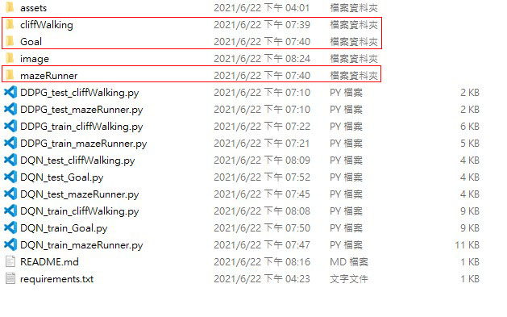

# Marlo-Xinhua-ChiYu
The final project of XinHua and ChiYu is DRL minecraft learning with Marlo environment.

## Requirement
All of Requirements are listed in requirement.txt.

There is an offical tutorial of Marlo environment installation: [Tutorial](https://marlo.readthedocs.io/en/latest/installation.html)

## Before Training or Testing
Start Minecraft Clients:

$MALMO_MINECRAFT_ROOT/launchClient.sh -port 10000

## Training
Our codes are named by following rules : [mothod] (DQN/DDPG) + [train/test] + [environment] (Goal/mazeRunner/cliffWalking)  

You can run our training codes by using a simple command.  
e.g.  
```
python DQN_train_Goal.py
```
weights would be saved to corresponding folder (Goal/mazeRunner/cliffWalking)
## Testing
Weights are updated to google drive.

Please download [weights.zip](https://drive.google.com/file/d/12BNl2e5Dh-lzW6v251Da0xy8S7OWZOiu/view?usp=sharing) and unzip
weights.zip in the same folder of codes.
See the layout:



After the processes above, You can run our testing codes by using a simple command.

e.g.  
```
python DQN_test_Goal.py
```
